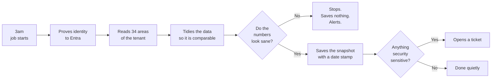

# How the Entra Backup Works

This document has two parts.

**Part 1 is written for everyone.** No technical background needed. It explains what the
system does, the thinking behind it, and what happens if you ever need to rebuild the
tenant. If you are an executive, an auditor, or a manager, Part 1 is the whole document as
far as you are concerned.

**Part 2 is for whoever maintains the code.** It covers each component in detail and
assumes familiarity with PowerShell and the Microsoft Graph API.

---

## Contents

**Part 1 — For everyone**
1. [What this system is](#1-what-this-system-is)
2. [How it works](#2-how-it-works)
3. [The decisions that shaped it](#3-the-decisions-that-shaped-it)
4. [How it avoids failing quietly](#4-how-it-avoids-failing-quietly)
5. [Recovering from a disaster](#5-recovering-from-a-disaster)

**Part 2 — For maintainers**

6. [Component reference](#6-component-reference)
7. [How the data is stored](#7-how-the-data-is-stored)
8. [What happens during a run](#8-what-happens-during-a-run)
9. [Working with the tool](#9-working-with-the-tool)
10. [Reference tables](#10-reference-tables)

---
---

# Part 1 — For everyone

## 1. What this system is

Microsoft Entra ID is where your organisation's user accounts, groups and security rules
live. It controls who can sign in, what they can reach, and under what conditions.

Microsoft does not keep a history of that configuration. If a security rule is changed
today, there is no supported way to see what it said yesterday. Deleted accounts are held
for roughly 30 days and then permanently removed.

This system fills that gap. Once a night it reads the configuration and writes it to a
private repository as ordinary text files. Because that repository uses version control,
the same technology software teams use to track changes to code, every night's snapshot is
kept and every difference between one night and the next is visible.

The result is three capabilities you did not previously have:

- **A record.** What the tenant looked like on any given date.
- **An audit trail.** Who changed what, and when.
- **A rebuild guide.** If the worst happens, precise instructions for putting it back.

---

## 2. How it works

The sequence each night is simple.

**1. A scheduled job starts.** It runs on GitHub's infrastructure at 3am UTC. No server of
ours is involved and there is nothing to keep running.

**2. It proves who it is.** GitHub and Entra have been set up to trust each other. Each
night GitHub issues a short-lived cryptographic proof that this specific job, in this
specific repository, is the one asking. Entra checks that proof and grants read access for
about an hour.

There is no password or secret key anywhere in this arrangement. That matters because
stored credentials are one of the more common ways systems get compromised, and they need
rotating before they expire. Here there is nothing to steal and nothing to rotate.

**3. It reads the tenant.** It works through a checklist of 34 areas to capture. The
account it uses has read-only permission, so even if it were somehow misused it could not
change anything.

**4. It tidies what it read.** This step is less obvious but it is what makes the whole
thing useful. Explained in [section 3](#3-the-decisions-that-shaped-it).

**5. It checks the result looks sane.** It compares tonight's counts against last night's.
If users have dropped from 2,000 to 20, something went wrong while reading, and it stops
without saving.

**6. It saves and, if needed, raises a flag.** Changes are recorded with a date stamp. If
anything security-sensitive changed, it opens a ticket.



---

## 3. The decisions that shaped it

Five choices explain most of how this is built. They are worth understanding because they
are the difference between a backup people actually use and one that gets ignored.

### 3.1 The snapshots must be directly comparable

This sounds like a technical detail. It is actually the single most important thing about
the system.

Imagine photographing a room every night to spot what has moved. If the camera shifted
slightly each time, every photo would look different and you would never spot the one
night someone moved a chair. The photos would be useless despite being perfectly accurate.

Reading configuration has the same problem. Microsoft returns the same information in a
different order each time, and some values change constantly on their own, such as an
internal synchronisation timestamp that updates every half hour whether or not anyone did
anything.

Left alone, every night's snapshot would differ from the last by hundreds of meaningless
lines. Real changes would be buried and nobody would read the history.

So the system deliberately puts everything in a fixed order and removes values that move
on their own. The result: when nothing has genuinely changed, tonight's files are
*identical* to last night's. A difference means something real happened.

We confirmed this against your live tenant. Running twice in a row produced exactly two
lines of difference, both recording the time the job ran.

### 3.2 Objects are tracked by their permanent ID, not their name

Every user, group and policy in Entra has a permanent identifier that never changes, plus
a display name that can change at any time.

The files are named after the permanent identifier. This looks unfriendly, since the
folders are full of long codes rather than names, but it is what lets the system track an
object through a rename. If a group is renamed from "Sales" to "Revenue", the history
records one small change. Had files been named after the display name, it would look like
the Sales group was deleted and an unrelated Revenue group created, and the group's whole
history would be severed.

Each folder includes an index file translating the codes back to names, so it stays
navigable.

### 3.3 What gets captured is a list, not code

The 34 areas being captured are defined in a plain configuration list. Adding something new
means adding a few lines to that list. It does not require writing or testing new code.

Practically: extending coverage is a small, low-risk change rather than a development
project.

### 3.4 It deliberately avoids Microsoft's own PowerShell toolkit

There is an official Microsoft toolkit for this kind of work. We chose not to use it.

It is large, slow to install, and changes the shape of the data it returns between
versions. Since this system depends entirely on producing identical output every night, a
component that reformats its results when it updates would break the one property that
makes the whole thing work.

Instead the system talks to Microsoft's web interface directly. It has no external
dependencies at all, which also means nothing can break it by updating underneath it.

### 3.5 It stops rather than record something wrong

Covered in [section 4](#4-how-it-avoids-failing-quietly).

---

## 4. How it avoids failing quietly

The obvious failure is a crash. Crashes are loud, they save nothing, and someone gets an
email. They are not the real risk.

The real risk is the run that *half* works. Suppose a network problem or a permissions
change means the system can only read 20 users out of 2,000. It saves what it read. The
history now records that 1,980 people were deleted last night, which never happened. The
false record is permanent, and the genuine history is buried underneath it.

Three safeguards prevent this.

**It checks itself before starting.** 22 automated tests run first, covering the parts
most likely to break. If the tool itself is faulty, the run stops before touching anything.

**It refuses incomplete reads.** If any area it is required to capture fails to respond,
the run stops. An incomplete picture is not saved.

**It compares against last night.** If any area shrinks by more than 20%, or empties out
entirely, the run stops and saves nothing. A person then confirms whether the drop is real.

Growth never triggers this. Adding 500 users is normal. Losing 500 needs a human to look.

There is a manual override for the case where a large deletion genuinely happened, such as
an office closing. It is deliberately a conscious decision rather than an automatic one,
because that override is the only thing standing between a bad night and a corrupted
history.

Areas your tenant is not licensed for, such as device management features you do not own,
are recorded as "skipped" rather than "empty". They never look like deletions.

---

## 5. Recovering from a disaster

This section is the honest version. It is less convenient than the phrase "we have
backups" usually implies.

### 5.1 The thing that governs everything

When Entra creates a user or group, it assigns a permanent identifier. Everything else in
your systems refers to that identifier rather than to the person's name. Group membership,
administrator rights, file permissions, mailbox access, application access.

If a deleted account is **properly restored**, it comes back with its original identifier
and everything that referred to it keeps working.

If an account is **recreated from scratch**, it gets a brand new identifier. The name,
email address and every detail can be identical, and every system will still treat it as a
different person. All its access has to be granted again.

Microsoft allows proper restore for about 30 days. That deadline is the single most
important fact on this page.

```
Was it deleted less than 30 days ago?

  YES  →  Restore it properly. Everything keeps working. Takes minutes.

  NO   →  Recreate it from the snapshot. New identity.
          All access must be granted again by hand.
```

### 5.2 The three recovery situations

**Something was deleted recently.** The good case. A script lists what can still be
restored and how many days remain on each. Restoring takes minutes and the account returns
intact.

Two things do not come back with it: the password, which needs resetting, and the user's
multi-factor authentication registration, which they set up again themselves.

**A setting or policy was changed or deleted.** The snapshot holds the previous version and
it can be put back. Security policies are deliberately restored in a switched-off state,
so they can be checked before going live. Restoring a sign-in policy straight into
enforcement is one of the more reliable ways to lock an entire organisation out of its own
systems, including the person doing the restoring.

**The whole tenant is lost.** Covered below.

### 5.3 Rebuilding an entire tenant

Set expectations correctly: this is several days of work by someone who knows the platform.
It is not a button.

What the snapshot gives you is complete and precise knowledge of what to build. That
removes the guesswork, the archaeology and the arguments about what the settings used to
be, which is usually most of the delay in a real incident. It does not remove the work.

The reason it cannot be automatic is section 5.1. Everything recreated gets a new
identifier, and the snapshot is full of references using the old ones. A security policy
referring to "the Finance group" stores that group's identifier. Recreate the group and
the reference points at nothing.

So a rebuild is: recreate things in the right order, keep a record of which old identifier
became which new one, and update all the references as you go.

**The order matters and cannot be shortcut.** Full detail is in
[section 10.6](#106-tenant-rebuild-order), but the shape is:

1. Domains first, since email addresses depend on them
2. Licences, which have to be purchased, not restored
3. Users
4. Groups and their membership
5. Applications, which need new secret keys generated and redistributed
6. Administrator assignments
7. Security policies last

**Security policies go last, and get switched on one at a time.** Turning a restored policy
set on all at once, when it refers to an emergency access account whose identifier changed
at step 3, locks out everybody including you. Before reaching this stage, confirm you have
a working emergency account that is excluded from all policies and whose sign-in you have
personally tested.

### 5.4 What no backup can recover

| | What it means in practice |
|---|---|
| Passwords | Every user needs a temporary password and a reset |
| Multi-factor authentication | Every user re-registers their phone or authenticator app |
| Application secret keys | New ones generated, then redistributed to every system that used them |
| Guest access | External collaborators re-accept their invitations |
| Original identifiers | Any other system storing Entra IDs needs updating too |

Microsoft never makes these readable to any tool, by design. This is not a gap in this
system; it applies to every Entra backup product. Any vendor claiming complete restore is
being loose with the word.

That last row catches people out. Other applications, file shares and SaaS tools that
stored Entra identifiers will not follow a rebuild either, and each needs its own
remapping.

---
---

# Part 2 — For maintainers

From here on the document assumes PowerShell and Microsoft Graph familiarity.

## 6. Component reference

Roughly 2,700 lines across 12 files.

| File | Lines | Role |
|---|---|---|
| `scripts/lib/Collector.psm1` | 392 | Manifest interpreter, file layout, pruning |
| `config/endpoints.psd1` | 356 | Declarative backup targets |
| `scripts/lib/Normalize.psm1` | 336 | Determinism engine |
| `scripts/lib/GraphClient.psm1` | 285 | REST client, paging, throttling |
| `scripts/lib/Auth.psm1` | 281 | Token acquisition, three modes |
| `tests/Test-Offline.ps1` | 240 | 22 regression checks |
| `scripts/Invoke-EntraBackup.ps1` | 224 | Orchestrator and entry point |
| `scripts/lib/SafetyGuard.psm1` | 160 | Mass-deletion tripwire |
| `scripts/Test-HighRiskChange.ps1` | 142 | Security-relevant diff classifier |
| `scripts/Restore/Restore-DeletedObject.ps1` | 100 | Soft-delete restore |
| `scripts/Restore/Restore-ConditionalAccessPolicy.ps1` | 84 | CA policy recreate |
| `config/settings.psd1` | 69 | Thresholds and tunables |

### 6.1 `Normalize.psm1`

The determinism engine. Everything else depends on it being correct.

| Function | Purpose |
|---|---|
| `ConvertTo-NormalizedObject` | Recursively strips volatile fields, sorts keys, orders unordered arrays |
| `ConvertTo-DeterministicJson` | Serialises with byte-identical output across PowerShell versions |
| `ConvertTo-JsonString` | RFC 8259 escaping, leaving non-ASCII literal |
| `Sort-NormalizedArray` | Stable ordering for scalar and object arrays |
| `Write-NormalizedJsonFile` | Writes UTF-8 no-BOM with LF, skipping the write when content is unchanged |

Volatile fields stripped at every depth: the `@odata.*` response plumbing,
`onPremisesLastSyncDateTime`, `refreshTokensValidFromDateTime`,
`signInSessionsValidFromDateTime`, plus a null `deletedDateTime`.

`onPremisesLastSyncDateTime` is the worst of them. On a synced tenant it moves roughly
every 30 minutes and on its own would dirty every user file every night.

`createdDateTime` and `lastPasswordChangeDateTime` are kept. They are stable and carry real
audit meaning.

`$script:SortableArrays` is an explicit allowlist rather than a blanket sort. Order is
meaningful in several Graph structures, Conditional Access condition sets among them, so
sorting everything would corrupt the data this exists to preserve.

Two PowerShell traps are encoded here:

- `[datetime]` values are normalised to UTC round-trip format. Graph sends timestamps as
  strings, but `ConvertFrom-Json` in some PowerShell versions rehydrates them into
  `[datetime]`, letting host culture and time zone leak into the output.
- Files use `[System.Text.UTF8Encoding]::new($false)` rather than `Out-File -Encoding utf8`,
  which emits a BOM on Windows PowerShell 5.1 and would make local and CI output differ.

Why hand-written JSON rather than `ConvertTo-Json`: 5.1 defaults to `-Depth 2` and escapes
all non-ASCII to `\uXXXX`, 7.x does neither. Using the built-in would make output depend on
which host produced it. A side benefit is that non-ASCII survives literally, so an umlaut
reads as an umlaut in the diff.

### 6.2 `GraphClient.psm1`

| Function | Purpose |
|---|---|
| `Initialize-GraphClient` | Registers a token provider scriptblock, resets counters |
| `Get-CurrentAccessToken` | Returns a valid token, refreshing 2 minutes before expiry |
| `Invoke-GraphRequest` | One request with retry on throttling and transient faults |
| `Get-GraphCollection` | Follows `@odata.nextLink` through every page |
| `Test-GraphPermissionError` | Classifies "this tenant will never answer this" errors |
| `Get-GraphClientStats` | Request and throttle counters for `run.json` |
| `Get-GraphCount` | Implemented but **not wired up**, see below |

Token refresh takes a provider *scriptblock* rather than a token string, because a
full-tenant backup can outlive the one-hour token lifetime. The client re-invokes the
provider transparently.

Retry policy:

| Status | Treatment |
|---|---|
| 429 | Retry, obeying `Retry-After` when present |
| 5xx, network failure | Exponential backoff capped at 120s, plus jitter |
| 400, 403, 404 | Not retried. Flagged as unavailable |
| Other 4xx | Fail immediately |

Jitter stops parallel categories retrying in lockstep and compounding a throttle.

400 sits in the unavailable set because Graph answers `deviceManagement` endpoints with
`400 Bad Request`, not `403`, when the tenant has no Intune subscription. Treating it as a
hard fault made an unlicensed tenant unbackable. This does not weaken required endpoints:
flagging is not skipping, and the collector still fails the run unless the endpoint is
declared `Optional`.

Unavailability uses a message-prefix sentinel (`ENTRABACKUP_ACCESS_DENIED`) checked by
`Test-GraphPermissionError`, not a custom exception class. A PowerShell class declared in
one module is not visible to `catch [TypeName]` in another module; the type fails to
resolve and the catch silently never matches. That was a real bug.

> **Dead surface.** `Get-GraphCount` and the `CountUri` manifest key are implemented but
> never called. The layout decision is made after fetch on the actual item count, which
> works correctly. `CountUri` entries in the manifest currently do nothing.

### 6.3 `Auth.psm1`

Three modes, selected by `Get-EntraTokenProvider -Mode Auto`:

| Mode | When | Permissions |
|---|---|---|
| `OIDC` | `ACTIONS_ID_TOKEN_REQUEST_URL` present (GitHub Actions) | Application |
| `ClientSecret` | A secret was supplied | Application |
| `DeviceCode` | Otherwise, for local runs | Delegated, yours |

| Function | Purpose |
|---|---|
| `Get-GitHubOidcToken` | Requests a token from the Actions token service |
| `ConvertFrom-JwtPayload` | Decodes a JWT payload for diagnostics, no signature validation |
| `Get-EntraTokenFromOidc` | Exchanges the GitHub token for a Graph token |
| `Get-EntraTokenFromClientSecret` | Client credentials fallback |
| `Get-EntraTokenFromDeviceCode` | Interactive sign-in |
| `Get-EntraTokenProvider` | Returns a refresh-capable closure |

The OIDC exchange posts the GitHub JWT to
`https://login.microsoftonline.com/<tenant>/oauth2/v2.0/token` as a `client_assertion` with
`client_assertion_type=urn:ietf:params:oauth:client-assertion-type:jwt-bearer`.

`Connect-MgGraph` has `-AccessToken` but no `-ClientAssertion`, so this exchange has to be
done directly against the token endpoint regardless of whether the SDK is used.

Device-code mode uses the first-party Microsoft Graph PowerShell public client
(`14d82eec-204b-4c2f-b7e8-296a70dab67e`) and requests read-only scopes by default. Restore
operations must pass write scopes explicitly.

### 6.4 `Collector.psm1`

| Function | Purpose |
|---|---|
| `Invoke-EndpointCollection` | Collects one manifest entry end to end |
| `Add-ChildCollections` | Fetches per-parent sub-collections, folds them into the parent |
| `Write-PerObjectCollection` | One `<guid>.json` per object |
| `Write-ShardedCollection` | Sharded NDJSON for large collections |
| `Write-CollectionIndex` | Generates `_index.json` |
| `Remove-StaleFiles` | Prunes files no longer backed by a live object |
| `Get-ShardName` | FNV-1a hash to a stable shard |
| `Get-SafeFileName` | Strips filesystem-illegal characters |

Child collections (group members and owners, role members) are folded into the parent
object's file rather than written alongside it. Each group stays self-contained for restore
and a membership change stays one diff in one place.

They are fetched per-parent rather than via `$expand`, because `$expand` caps at 20 related
objects and **silently truncates**. That is a correctness trap, not a performance one.
These are N+1 requests and dominate runtime on large tenants, hence `MaxChildFetchParents`.

Pruning is required for correctness. Without `Remove-StaleFiles` a deleted user would
linger indefinitely and the snapshot would stop reflecting the tenant. The safety guard
runs before any of it is committed.

Shard assignment uses FNV-1a rather than `GetHashCode()`, which is randomised per process
in .NET Core and would reshuffle every object into a new shard on every run. Two arithmetic
traps are encoded:

- The multiply is done in `[uint64]` and masked down. PowerShell widens on overflow rather
  than wrapping, so multiplying in `uint32` throws instead of truncating.
- The mask is written in decimal (`4294967295`). Windows PowerShell 5.1 parses the hex
  literal `0xFFFFFFFF` as Int32 `-1`, making `-band` a silent no-op.

### 6.5 `SafetyGuard.psm1`

`Test-BackupSafety` compares this run's counts against the previous run's.
`Write-SafetyReport` renders only the rows that moved.

Blocks when a collection shrinks past `MaxShrinkFraction` (default 20%) or empties out
entirely having previously held objects.

Three cases correctly pass: the first run, growth of any size, and collections passed in
`-SkippedCollections` because they returned 403 this time.

### 6.6 `Invoke-EntraBackup.ps1`

Parameters: `-Category`, `-AuthMode`, `-TenantId`, `-ClientId`, `-ClientSecret`,
`-BackupRoot`, `-AcceptShrink`. Exit codes: `0` success, `1` error, `2` guard tripped.

### 6.7 `Test-HighRiskChange.ps1`

Runs between `git add` and `git commit`. Reads the staged diff, groups findings by area
using `HighRiskPaths`, and specifically detects a Conditional Access policy switched to
disabled, which is a different event from one merely edited. Writes `high-risk-report.md`
plus `high_risk` and `finding_count` to `$GITHUB_OUTPUT`. It reports, never blocks.

### 6.8 Module instance identity

`Collector.psm1` imports `GraphClient` and `Normalize` **without `-Force`**, deliberately.

`-Force` loads a second, separate instance rather than reusing the caller's. Module state
is per-instance, so `Initialize-GraphClient` in the entry script configured one instance
while every collection call reached the other. The symptom was all 34 endpoints failing
with "Graph client not initialised", after the auth smoke test had passed.

The offline tests could not catch it, since they mock `Get-GraphCollection` inside
Collector, which is exactly the broken seam. `Test-Offline.ps1` now has an explicit wiring
test that initialises the client at script scope and asserts Collector observes it.

**Rule: import leaf modules first, and never `-Force` a nested import.**

---

## 7. How the data is stored

```
backup/
├── _meta/run.json                    tenant, timestamp, counts, skips
├── directory/
│   ├── users/{_index.json, <guid>.json …}
│   ├── groups/                       members + owners folded in
│   ├── directoryRoles/               members folded in
│   └── administrativeUnits/ domains/ organization/ subscribedSkus/
├── policies/
│   ├── conditionalAccessPolicies/ namedLocations/
│   └── authorizationPolicy/settings.json      ← singletons
├── applications/{applications, servicePrincipals, oauth2PermissionGrants}/
├── governance/{roleDefinitions, roleAssignments, roleEligibilitySchedules, …}/
└── intune/{deviceConfigurations, deviceCompliancePolicies, …}/
```

Collections at or below `ShardThreshold` (2,000) use one file per object. Above it,
sharded newline-delimited JSON, because a directory holding tens of thousands of files
makes git slow and the GitHub UI unusable. Shard membership is a stable hash of the object
ID, so an object never migrates and a change touches exactly one shard.

`_index.json` maps IDs to names:

```json
{
  "collection": "groups",
  "count": 2,
  "idField": "id",
  "items": {
    "0847a506-6432-478d-924e-f86a8d7b9939": "Group1",
    "ee57c5a7-50fe-4d17-9783-772a525baeca": "Group2"
  },
  "layout": "per-object"
}
```

`_meta/run.json` is both the safety guard's baseline and the run's audit record, holding
`tenantId`, `capturedAtUtc`, `durationSeconds`, `graphRequests`, `throttleEvents`,
`skippedEndpoints` and per-collection `counts`.

It is the only file expected to change every run. A commit of `(+0 ~1 -0)` means that file
and nothing else, so the tenant was unchanged.

---

## 8. What happens during a run

1. **Verify configuration.** `AZURE_TENANT_ID` and `AZURE_CLIENT_ID` present and
   GUID-shaped. Format is checked, not just presence: a placeholder pasted with its angle
   brackets draws a bare HTTP 400 from Entra naming neither value nor reason.
2. **Run offline tests.** 22 checks, no tenant needed.
3. **Authenticate.** OIDC exchange, then `GET /v1.0/organization` as a smoke test.
4. **Read the previous baseline** before collection overwrites it.
5. **Collect.** Each manifest entry: fetch with paging, fold in children, normalise, write
   changed files, prune stale, write `_index.json`. Optional endpoints returning 400/403/404
   are skipped and recorded.
6. **Fail on required-endpoint errors.** Refuse to record an incomplete snapshot.
7. **Safety check.** Counts against baseline; exit 2 on violation.
8. **Write `run.json`,** only after the safety check passes.
9. **Stage, classify, commit** as `backup: <date> (+A ~M -D)`, then push.
10. **Raise an issue** if security-relevant changes were found. Non-fatal, since the
    snapshot is already committed.

---

## 9. Working with the tool

### 9.1 Running a backup

```powershell
.\scripts\Invoke-EntraBackup.ps1                                  # everything, device-code sign-in
.\scripts\Invoke-EntraBackup.ps1 -Category directory              # one category
.\scripts\Invoke-EntraBackup.ps1 -Category directory,policies -Verbose
.\scripts\Invoke-EntraBackup.ps1 -BackupRoot C:\temp\entra-test   # write elsewhere
```

Categories: `directory`, `policies`, `applications`, `governance`, `intune`.

Local runs use delegated permissions from your own sign-in, so they read only what you can
read. CI uses application permissions and may see more.

```bash
gh workflow run "Entra Backup" --ref main
gh workflow run "Entra Backup" --ref main -f categories=directory,policies
gh workflow run "Entra Backup" --ref main -f accept_shrink=true
gh run list --workflow="Entra Backup"
```

### 9.2 Running the tests

```powershell
.\tests\Test-Offline.ps1     # 22 checks, no tenant, network or credentials
```

Covers module wiring, determinism, pruning, sharding, the safety guard and singletons.

### 9.3 Adding a backup target

Edit [`config/endpoints.psd1`](../config/endpoints.psd1):

```powershell
@{
    Name      = 'myNewCollection'      # directory name + key in run.json
    Category  = 'policies'             # top-level folder
    Mode      = 'Collection'           # or 'Singleton'
    IdField   = 'id'                   # filename source, must be immutable
    NameField = 'displayName'          # shown in _index.json
    Uri       = '/v1.0/some/endpoint'  # single-quoted, keeps $select literal
    Optional  = $true                  # skip on 400/403/404 instead of failing
    Children  = @(
        @{ Name = 'members'; Uri = '/v1.0/some/endpoint/{id}/members' }
    )
    Notes     = 'Why this is here and what it needs.'
}
```

Grant any new Graph permission, run locally against that category, then run twice to
confirm the second run is clean. If a child collection name is not already in
`$script:SortableArrays` in `Normalize.psm1`, add it or its ordering will churn.

### 9.4 Tuning the normaliser when a run is noisy

```powershell
.\scripts\Invoke-EntraBackup.ps1 -Category directory
git diff --stat backup/                     # which collections?
git diff backup/directory/users/ | head -40 # which field?
```

Add the culprit to `$script:VolatileFields`, then run twice to confirm. Ask whether the
field is information before stripping it. A licence change is signal; a sync timestamp is
not.

### 9.5 When the safety guard trips

Nothing has been committed. The message names the collection and the size of the drop.

Check whether the drop is real against the portal, whether the run was throttled
(`throttleEvents`), and whether a permission or licence lapsed (`skippedEndpoints`). If
genuine:

```bash
gh workflow run "Entra Backup" --ref main -f accept_shrink=true
```

### 9.6 Querying the history

```bash
git log --oneline -- backup/
git log --follow -p -- backup/policies/conditionalAccessPolicies/<id>.json
git log --since=2026-08-01 --until=2026-08-02 -p -- backup/
git log --diff-filter=D -- backup/directory/users/<id>.json    # when was it deleted?
git diff HEAD~30 HEAD -- backup/directory/directoryRoles/
git show 'HEAD@{2026-08-01}:backup/policies/authorizationPolicy/settings.json'
```

`--follow` works across renames because filenames are immutable GUIDs. Use `_index.json` to
go from a display name to an ID.

### 9.7 Restore mechanics

```powershell
.\scripts\Restore\Restore-DeletedObject.ps1 -Type users -List
.\scripts\Restore\Restore-DeletedObject.ps1 -Type users -Id <guid> -Confirm:$false

.\scripts\Restore\Restore-ConditionalAccessPolicy.ps1 -Path <file>                 # dry run
.\scripts\Restore\Restore-ConditionalAccessPolicy.ps1 -Path <file> -Confirm:$false
```

For types without a dedicated script:

```powershell
Import-Module .\scripts\lib\GraphClient.psm1 -Force -DisableNameChecking
Import-Module .\scripts\lib\Auth.psm1        -Force -DisableNameChecking

# Write scopes must be requested explicitly; the defaults are read-only.
$token = Get-EntraTokenFromDeviceCode -Scopes @('Group.ReadWrite.All')
Initialize-GraphClient -TokenProvider { $token }.GetNewClosure()

$obj = Get-Content .\backup\directory\groups\<id>.json -Raw | ConvertFrom-Json

$payload = @{}
foreach ($p in $obj.PSObject.Properties) {
    if ($p.Name -in @('id','createdDateTime','modifiedDateTime','members','owners')) { continue }
    if ($p.Name.StartsWith('@')) { continue }
    $payload[$p.Name] = $p.Value
}

$new = Invoke-GraphRequest -Uri '/v1.0/groups' -Method POST `
                           -Body ($payload | ConvertTo-Json -Depth 100)

foreach ($m in $obj.members) {
    Invoke-GraphRequest -Uri "/v1.0/groups/$($new.id)/members/`$ref" -Method POST `
        -Body (@{ '@odata.id' = "https://graph.microsoft.com/v1.0/directoryObjects/$($m.id)" } | ConvertTo-Json)
}
```

### 9.8 ID remapping during a rebuild

```powershell
$idMap = @{}
$idMap['1111-old-user-guid']  = $newUser.id
$idMap['2222-old-group-guid'] = $newGroup.id
$idMap | ConvertTo-Json | Set-Content .\id-map.json   # checkpoint constantly

function Update-References {
    param([string] $Json, [hashtable] $Map)
    foreach ($old in $Map.Keys) { $Json = $Json.Replace($old, $Map[$old]) }
    return $Json
}
```

A blunt string replace over serialised JSON is appropriate here. GUIDs are globally
unique, so a false positive is not realistically possible.

### 9.9 Validating a restore

```powershell
.\scripts\Invoke-EntraBackup.ps1 -BackupRoot C:\temp\restored

Compare-Object `
    (Get-Content .\backup\policies\conditionalAccessPolicies\_index.json | ConvertFrom-Json).items.PSObject.Properties.Value `
    (Get-Content C:\temp\restored\policies\conditionalAccessPolicies\_index.json | ConvertFrom-Json).items.PSObject.Properties.Value
```

Comparing `_index.json` display names rather than files ignores the GUID churn a rebuild
inevitably causes.

---

## 10. Reference tables

### 10.1 Exit codes

| Code | Meaning | Action |
|---|---|---|
| 0 | Success | None |
| 1 | Auth failed, or a required endpoint failed | Read the log; nothing committed |
| 2 | Safety guard tripped | Verify the drop, then `-AcceptShrink` |

### 10.2 Graph permissions

Required: `Directory.Read.All`, `User.Read.All`, `Group.Read.All`, `Organization.Read.All`,
`Policy.Read.All`, `Application.Read.All`, `RoleManagement.Read.All`.

Optional: `DelegatedPermissionGrant.Read.All` (consent grants),
`RoleManagementPolicy.Read.Directory` (PIM, P2), `EntitlementManagement.Read.All` (P2),
`AccessReview.Read.All` (P2), `DeviceManagementConfiguration.Read.All`,
`DeviceManagementApps.Read.All`, `DeviceManagementServiceConfig.Read.All` (Intune).

All are application permissions and all require admin consent.

### 10.3 Troubleshooting

| Symptom | Cause | Fix |
|---|---|---|
| `AADSTS70021: No matching federated identity record` | Credential subject does not match token `sub` | Run OIDC Probe and compare exactly. Usually the immutable-subject mismatch |
| `GitHub OIDC environment not present` | Job missing `permissions: id-token: write` | Add it |
| `is not a valid GUID` | Placeholder pasted with angle brackets | `gh variable set NAME --body <guid-no-brackets>` |
| `Graph returned 403` | Permission not granted or consent not clicked | Grant and admin-consent |
| `Graph returned 400` on Intune | No Intune subscription | Expected. Endpoint is Optional and skips |
| `Graph client not initialised` | Split module instance | Import leaf modules first, no `-Force` nested |
| `Resource not accessible by integration` | Scope missing from `permissions:` block | Declaring the block drops every unlisted scope |
| Second run has a large diff | Tenant-specific volatile field | Add to `$script:VolatileFields` |
| Guard trips repeatedly | Real shrink, or a lapsed permission | Check `skippedEndpoints` in `run.json` |

### 10.4 Tunables (`config/settings.psd1`)

| Setting | Default | Effect |
|---|---|---|
| `ShardThreshold` | 2000 | Objects above which a collection switches to sharded NDJSON |
| `ShardCount` | 16 | Shards once sharding kicks in |
| `MaxShrinkFraction` | 0.20 | Shrink beyond this aborts the run |
| `FailOnEmptyCollection` | `$true` | A collection emptying out always aborts |
| `MaxRetries` | 6 | Retry ceiling per request |
| `MaxChildFetchParents` | 5000 | Skip N+1 child fetches above this many parents |
| `DefaultCategories` | all five | Collected when `-Category` is omitted |
| `HighRiskPaths` | 7 paths | Paths that trigger issue creation |
| `PrivilegedRoleTemplateIds` | 8 roles | Roles treated as privileged for alerting |

### 10.5 Extension points

| Want to | Do |
|---|---|
| Back up something new | Add an entry to `config/endpoints.psd1` |
| Change what raises an alert | Edit `HighRiskPaths` in `config/settings.psd1` |
| Reduce PII captured | Trim the `$select` on the `users` entry. Cheap now, needs history rewriting later |
| Change the schedule | Edit the `cron` in `.github/workflows/backup.yml` |
| Send alerts elsewhere | Replace the issue-creation step. `high-risk-report.md` is the payload |
| Back up a second tenant | Fork with different repo variables and its own federated credential |

### 10.6 Tenant rebuild order

Dependencies run strictly downward. Do not skip ahead. Plain-English context in
[section 5.3](#53-rebuilding-an-entire-tenant).

| # | Stage | Source | Notes |
|---|---|---|---|
| 1 | Custom domains | `directory/domains/` | Add and verify via DNS first. UPN suffixes depend on it |
| 2 | Licences | `directory/subscribedSkus/` | A purchase, not a restore. Tells you what to buy |
| 3 | Org settings | `directory/organization/` | Branding, technical contacts |
| 4 | Users | `directory/users/` | New GUIDs. Temporary passwords; users re-register MFA. **Record every old-to-new ID** |
| 5 | Groups | `directory/groups/` | Create, then add membership from the folded-in `members`, remapping IDs. `membershipRule` restores as-is |
| 6 | Administrative units | `directory/administrativeUnits/` | Needs users and groups |
| 7 | App registrations | `applications/applications/` | **New secrets and certificates must be generated** and redistributed. Credential metadata says what existed, never the material |
| 8 | Service principals, consent | `applications/servicePrincipals/`, `oauth2PermissionGrants/` | Re-consent required. First-party Microsoft principals recreate themselves |
| 9 | Named locations | `policies/namedLocations/` | Before CA policies, which reference them |
| 10 | Directory role assignments | `governance/roleAssignments/` | `roleDefinitions` are built-in and already present. Remap principal IDs |
| 11 | Conditional Access | `policies/conditionalAccessPolicies/` | **Create every one disabled.** Remap user, group, app and location IDs. Enable only after break-glass is confirmed |
| 12 | Authorization, auth methods | `policies/authorizationPolicy/` | Tenant-wide behaviour |
| 13 | PIM | `governance/roleEligibilitySchedules/`, `roleManagementPolicies/` | P2. Needs roles and principals |
| 14 | Entitlement management | `governance/entitlement*/` | P2. Catalogs, then access packages, then policies |
| 15 | Intune | `intune/` | Assignments reference groups, so remap |
