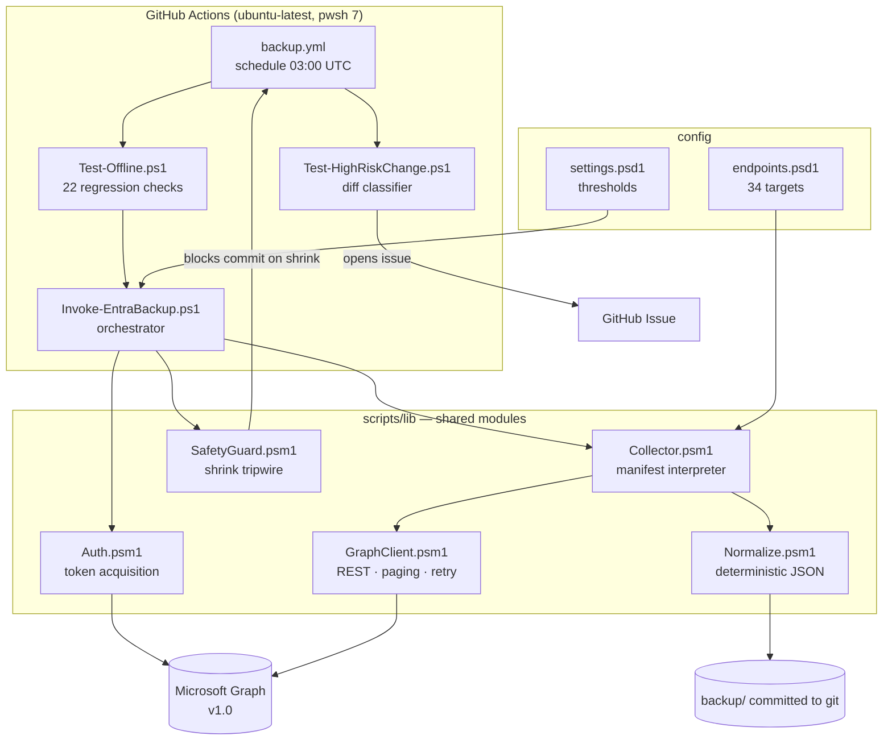

# Architecture and Operations Guide

Complete reference for the Entra tenant backup tool: what every component does and why,
how to operate it, and how to restore a tenant from what it stores.

**Companion documents:** [SETUP.md](SETUP.md) for first-time configuration ·
[SCOPE.md](SCOPE.md) for the endpoint-by-endpoint coverage table ·
[RESTORE.md](RESTORE.md) for the short restore cheat-sheet.

---

## Table of contents

1. [The problem and the approach](#1-the-problem-and-the-approach)
2. [Design decisions and their rationale](#2-design-decisions-and-their-rationale)
3. [System overview](#3-system-overview)
4. [Component reference](#4-component-reference)
5. [On-disk data model](#5-on-disk-data-model)
6. [Execution flow](#6-execution-flow)
7. [How-to guide](#7-how-to-guide)
8. [Restoring a tenant](#8-restoring-a-tenant)
9. [Operational reference](#9-operational-reference)

---

## 1. The problem and the approach

Microsoft Entra ID retains soft-deleted objects for roughly 30 days and retains **no
configuration history at all**. There is no supported way to ask what a Conditional
Access policy looked like last quarter, who was added to Global Administrator and when,
or what changed in the tenant overnight.

The approach is to snapshot tenant configuration to deterministic JSON on a schedule and
commit it to git. Git then supplies what Entra does not: history, diffs, blame,
point-in-time retrieval, and change notification.

The critical consequence is that **the value of this tool lives in the diff, not the
data**. A snapshot that produces a thousand lines of churn per run is worse than no
snapshot at all, because real changes become invisible. Almost every design decision
below follows from that.

---

## 2. Design decisions and their rationale

### 2.1 Determinism above everything

Collecting Graph data is straightforward. Producing *byte-identical* output when nothing
has changed is the hard part, and it is what makes the history readable.

Four separate forces break determinism, each handled explicitly:

| Force | Handling |
|---|---|
| Graph does not guarantee JSON key order between responses | Recursive alphabetical key sort |
| Some fields change on their own | Explicit volatile-field strip list |
| Collections come back in arbitrary order | Sort by stable key — but only for arrays where order is not meaningful |
| `ConvertTo-Json` differs between PowerShell 5.1 and 7 | Hand-written JSON serialiser |

The last one deserves explanation. Windows PowerShell 5.1 defaults to `-Depth 2` and
escapes every non-ASCII character to `\uXXXX`; PowerShell 7 does neither. Using the
built-in would mean the snapshot depended on *which host produced it*, so a local run and
a CI run of an unchanged tenant would differ. `Normalize.psm1` therefore carries its own
writer. A side benefit: non-ASCII characters are emitted literally, so an umlaut in a
display name reads as an umlaut in the diff.

**Measured result:** a second run against an unchanged tenant changed exactly two lines —
the timestamp and duration in `run.json`. All 565 data files were byte-identical.

### 2.2 Immutable IDs as filenames

Files are named `<objectGuid>.json`, never by display name or UPN.

Naming by display name would make every rename appear as a delete plus an add — two large
diffs that destroy the object's history and break `git log --follow`. Naming by GUID makes
a rename a **one-line change in `_index.json`**, and the object's file keeps its full
history.

The cost is that a directory of GUIDs is unreadable to a human. `_index.json` in each
collection folder repays that by mapping every ID to its display name.

### 2.3 Manifest-driven collection

Every backup target is a declarative entry in [`config/endpoints.psd1`](../config/endpoints.psd1)
interpreted by one generic routine. Adding a collection is a config edit, not new code.
34 endpoints across five categories are currently driven by a single ~90-line function.

### 2.4 No Microsoft.Graph PowerShell SDK

The SDK is 40+ modules, slow to install in CI, and changes its output shapes between
versions. For a tool whose entire purpose is byte-stable output, a dependency that
reshapes its return values on upgrade is a liability.

A thin REST client over `Invoke-RestMethod` gives one auth path, no install step, exactly
what Graph sent, and identical behaviour on PowerShell 5.1 and 7. The whole tool has
**zero external module dependencies**.

A related discovery drove the auth design: `Connect-MgGraph` has `-AccessToken` but no
`-ClientAssertion`, so the OIDC federated exchange has to be done directly against the
token endpoint regardless of whether the SDK is used.

### 2.5 Fail closed, never commit a partial truth

The dangerous failure is not a crash — a crash commits nothing and is obvious. It is the
**partial success**: throttling or a revoked permission returns 20 users where there were
2,000, and the run commits a fictional mass deletion on top of real history.

Three layers prevent this:

1. A required endpoint that errors aborts the run before the safety check.
2. `SafetyGuard` compares per-collection counts against the previous run and blocks any
   shrink beyond a threshold.
3. The workflow only commits after both pass.

Growth is never blocked — onboarding 500 users is not a hazard; losing 500 is.

### 2.6 Secretless authentication

GitHub OIDC workload identity federation. GitHub mints a short-lived token proving which
repository and branch is running; Entra exchanges it for a Graph token. No client secret
exists anywhere, so there is nothing to rotate, expire, or leak.

---

## 3. System overview



**Module dependency order matters.** `GraphClient` and `Normalize` are leaf modules and
must be imported *first*; `Collector` imports them without `-Force` so it binds to those
exact instances. See [4.8](#48-a-note-on-module-instance-identity) — this caused a real
production failure.

---

## 4. Component reference

Total: ~2,700 lines across 12 files.

| File | Lines | Role |
|---|---|---|
| `scripts/lib/Collector.psm1` | 392 | Manifest interpreter, file layout, pruning |
| `config/endpoints.psd1` | 356 | Declarative backup targets |
| `scripts/lib/Normalize.psm1` | 336 | Determinism engine |
| `scripts/lib/GraphClient.psm1` | 285 | REST client, paging, throttling |
| `scripts/lib/Auth.psm1` | 281 | Token acquisition, three modes |
| `tests/Test-Offline.ps1` | 240 | 22 regression checks |
| `scripts/Invoke-EntraBackup.ps1` | 224 | Orchestrator and entry point |
| `scripts/lib/SafetyGuard.psm1` | 160 | Mass-deletion tripwire |
| `scripts/Test-HighRiskChange.ps1` | 142 | Security-relevant diff classifier |
| `scripts/Restore/Restore-DeletedObject.ps1` | 100 | Soft-delete restore |
| `scripts/Restore/Restore-ConditionalAccessPolicy.ps1` | 84 | CA policy recreate |
| `config/settings.psd1` | 69 | Thresholds and tunables |

### 4.1 `Normalize.psm1` — the determinism engine

Everything else depends on this being correct.

| Function | Purpose |
|---|---|
| `ConvertTo-NormalizedObject` | Recursively strips volatile fields, sorts keys, orders unordered arrays |
| `ConvertTo-DeterministicJson` | Serialises with byte-identical output across PowerShell versions |
| `ConvertTo-JsonString` | RFC 8259 string escaping, leaving non-ASCII literal |
| `Sort-NormalizedArray` | Stable ordering for scalar and object arrays |
| `Write-NormalizedJsonFile` | Normalises, serialises, writes UTF-8 no-BOM with LF; **skips the write when unchanged** |

**Volatile fields** (`$script:VolatileFields`) are stripped at every depth:
`@odata.context`, `@odata.etag`, `@odata.id`, `@odata.nextLink`, `@odata.deltaLink`,
`@odata.count`, `@microsoft.graph.tips`, `onPremisesLastSyncDateTime`,
`refreshTokensValidFromDateTime`, `signInSessionsValidFromDateTime`. A null
`deletedDateTime` is also dropped.

> `onPremisesLastSyncDateTime` is the worst offender — on a Connect-synced tenant it
> moves roughly every 30 minutes and by itself would dirty every user file on every run.

Deliberately **kept**: `createdDateTime` and `lastPasswordChangeDateTime` are stable and
genuinely meaningful in an audit trail.

**Sortable arrays** (`$script:SortableArrays`) is an explicit allowlist, not a blanket
sort. Order is meaningful in plenty of Graph structures — Conditional Access condition
sets among them — so sorting every array would corrupt the data it exists to preserve.
Scalar arrays sort by value; object arrays sort by a named key (`assignedLicenses` by
`skuId`, `members` by `id`, and so on).

**Two PowerShell traps encoded here:**

- `[datetime]` values are normalised to UTC round-trip format. Graph sends timestamps as
  strings, but `ConvertFrom-Json` in some PowerShell versions silently rehydrates them
  into `[datetime]`, at which point culture and time zone would leak into the output.
- Files are written with `[System.Text.UTF8Encoding]::new($false)` rather than
  `Out-File -Encoding utf8`, which emits a BOM on Windows PowerShell 5.1 and would make
  local and CI output differ byte-for-byte.

### 4.2 `GraphClient.psm1` — REST transport

| Function | Purpose |
|---|---|
| `Initialize-GraphClient` | Registers a token provider scriptblock, resets counters |
| `Get-CurrentAccessToken` | Returns a valid token, refreshing 2 minutes before expiry |
| `Invoke-GraphRequest` | One request with retry on throttling and transient faults |
| `Get-GraphCollection` | Follows `@odata.nextLink` to retrieve every page |
| `Test-GraphPermissionError` | Classifies "this tenant will never answer this" errors |
| `Get-GraphClientStats` | Request and throttle counters for `run.json` |
| `Get-GraphCount` | ⚠️ Defined but **not currently wired up** — see below |

**Token refresh** takes a provider *scriptblock* rather than a token string, because a
full-tenant backup can outlive the one-hour lifetime of a Graph access token. The client
re-invokes the provider transparently.

**Retry policy:**

| Status | Treatment |
|---|---|
| 429 | Retry, obeying the `Retry-After` header when present |
| 5xx, network failure | Retry with exponential backoff, capped at 120s, plus jitter |
| 400, 403, 404 | **Not retried.** Flagged as "unavailable" |
| Other 4xx | Fail immediately |

Jitter exists so parallel categories do not retry in lockstep and compound the throttle.

**Why 400 is in the unavailable set:** Graph answers `deviceManagement` endpoints with
`400 Bad Request` — not `403` — when the tenant has no Intune subscription. Treating 400
as a hard fault made an unlicensed tenant unbackable. This does not weaken required
endpoints: flagging is not skipping, and the collector still fails the run unless the
endpoint is declared `Optional`.

**The sentinel pattern.** Unavailability is signalled by a message prefix
(`ENTRABACKUP_ACCESS_DENIED`) checked by `Test-GraphPermissionError`, rather than a custom
exception class. A PowerShell class declared in one module is **not visible to
`catch [TypeName]` in a different module** — the type fails to resolve and the catch
silently never matches. This was a real bug; the sentinel works across module boundaries
and PowerShell versions.

> **Known dead surface:** `Get-GraphCount` and the `CountUri` manifest key are implemented
> but never called. The intent was a pre-flight `$count` to pick the file layout before
> fetching; in practice the layout decision is made after fetch on the actual item count,
> which works correctly. Left in place because it is harmless and useful if pre-flight
> sizing is ever wanted. **`CountUri` entries in the manifest currently do nothing.**

### 4.3 `Auth.psm1` — token acquisition

Three modes, selected automatically by `Get-EntraTokenProvider -Mode Auto`:

| Mode | When | Permissions |
|---|---|---|
| `OIDC` | `ACTIONS_ID_TOKEN_REQUEST_URL` is present (GitHub Actions) | Application |
| `ClientSecret` | A secret was supplied | Application |
| `DeviceCode` | Otherwise — interactive local runs | Delegated (yours) |

| Function | Purpose |
|---|---|
| `Get-GitHubOidcToken` | Requests an OIDC token from the Actions token service |
| `ConvertFrom-JwtPayload` | Decodes a JWT payload for diagnostics (no signature validation) |
| `Get-EntraTokenFromOidc` | Exchanges the GitHub token for a Graph token |
| `Get-EntraTokenFromClientSecret` | Client credentials fallback |
| `Get-EntraTokenFromDeviceCode` | Interactive sign-in, polls the token endpoint |
| `Get-EntraTokenProvider` | Returns a refresh-capable closure for the chosen mode |

**The OIDC exchange** posts the GitHub JWT to
`https://login.microsoftonline.com/<tenant>/oauth2/v2.0/token` as a `client_assertion`
with `client_assertion_type=urn:ietf:params:oauth:client-assertion-type:jwt-bearer`.

Device-code mode uses the first-party Microsoft Graph PowerShell public client
(`14d82eec-204b-4c2f-b7e8-296a70dab67e`) and requests **read-only** scopes by default.
Restore operations must pass write scopes explicitly.

### 4.4 `Collector.psm1` — manifest interpreter

| Function | Purpose |
|---|---|
| `Invoke-EndpointCollection` | Collects one manifest entry end to end |
| `Add-ChildCollections` | Fetches per-parent sub-collections, folds them into the parent |
| `Write-PerObjectCollection` | One `<guid>.json` per object |
| `Write-ShardedCollection` | Sharded NDJSON for large collections |
| `Write-CollectionIndex` | Generates `_index.json` |
| `Remove-StaleFiles` | Prunes files no longer backed by a live object |
| `Get-ShardName` | FNV-1a hash → stable shard assignment |
| `Get-SafeFileName` | Strips filesystem-illegal characters |

**Child collections** (group members and owners, role members) are folded into the parent
object's own file rather than written alongside it. This keeps each group self-contained
for restore and keeps a membership change as one diff in one place. They are fetched
per-parent rather than via `$expand`, because `$expand` caps at 20 related objects and
**silently truncates** — a correctness trap, not just a performance one.

These are N+1 requests and dominate runtime on large tenants, hence the
`MaxChildFetchParents` ceiling.

**Pruning is mandatory for correctness.** Without `Remove-StaleFiles`, a deleted user
would linger in the snapshot forever and the backup would quietly stop reflecting the
tenant. The safety guard runs before any of it is committed.

**Shard assignment uses FNV-1a**, not `GetHashCode()`, which is randomised per process in
.NET Core and would reshuffle every object into a new shard on every run. Two PowerShell
arithmetic traps are encoded here:

- The multiply is done in `[uint64]` and masked back down; PowerShell widens on overflow
  rather than wrapping, so multiplying in `uint32` throws instead of truncating.
- The mask is written in decimal (`4294967295`). Windows PowerShell 5.1 parses the hex
  literal `0xFFFFFFFF` as **Int32 `-1`**, which makes `-band` a silent no-op.

### 4.5 `SafetyGuard.psm1` — mass-deletion tripwire

| Function | Purpose |
|---|---|
| `Test-BackupSafety` | Compares this run's counts against the previous run's |
| `Write-SafetyReport` | Renders the comparison, showing only rows that moved |

Blocks when any collection **shrinks past `MaxShrinkFraction`** (default 20%) or **empties
out entirely** when it previously held objects.

Three cases correctly *pass*:

- **First run** — no baseline exists.
- **Growth of any size** — never a hazard.
- **Skipped collections** — a licence-gated endpoint that returned 403 this run is passed
  in `-SkippedCollections` and recorded as `Skipped`, never as a deletion.

### 4.6 `Invoke-EntraBackup.ps1` — orchestrator

Parameters: `-Category`, `-AuthMode`, `-TenantId`, `-ClientId`, `-ClientSecret`,
`-BackupRoot`, `-AcceptShrink`.

Exit codes: `0` success · `1` error · `2` safety guard tripped.

### 4.7 `Test-HighRiskChange.ps1` — diff classifier

Runs between `git add` and `git commit`. Separates security-relevant changes from the
routine churn of people joining and leaving, using `HighRiskPaths` in `settings.psd1`.
Reads the staged diff, groups findings by area, and specifically detects a Conditional
Access policy **switched to disabled** — materially different from one merely edited, and
the change most likely to be an attack or a mistake.

Writes `high-risk-report.md`, plus `high_risk` and `finding_count` to `$GITHUB_OUTPUT`.
It reports; it never blocks.

### 4.8 A note on module instance identity

`Collector.psm1` imports `GraphClient` and `Normalize` **without `-Force`**, deliberately.

`-Force` loads a *second, separate instance* of a module rather than reusing the caller's.
Module state is per-instance, so `Initialize-GraphClient` called by the entry script
configured one instance while every collection call reached the other. The symptom was all
34 endpoints failing with "Graph client not initialised" — *after* the auth smoke test had
passed.

The offline tests could not catch this: they mock `Get-GraphCollection` inside Collector,
which is exactly the seam that was broken. `Test-Offline.ps1` now has an explicit wiring
test that initialises the client at script scope and asserts Collector observes it.

**Rule:** import leaf modules first, and never `-Force` a nested import.

---

## 5. On-disk data model

```
backup/
├── _meta/run.json                    tenant, timestamp, counts, skips
├── directory/
│   ├── users/{_index.json, <guid>.json …}
│   ├── groups/                       members + owners folded in
│   ├── directoryRoles/               members folded in
│   ├── administrativeUnits/ domains/ organization/ subscribedSkus/
├── policies/
│   ├── conditionalAccessPolicies/ namedLocations/
│   ├── authorizationPolicy/settings.json      ← singletons
│   └── authenticationMethodsPolicy/ crossTenantAccessPolicy*/ …
├── applications/{applications, servicePrincipals, oauth2PermissionGrants}/
├── governance/{roleDefinitions, roleAssignments, roleEligibilitySchedules,
│               roleManagementPolicies, accessReviews, entitlement*}/
└── intune/{deviceConfigurations, deviceCompliancePolicies, …}/
```

**Layouts.** Collections at or below `ShardThreshold` (default 2,000) use one file per
object. Above it, sharded newline-delimited JSON — a directory holding tens of thousands
of files makes git slow and the GitHub UI unusable. Shard membership is a stable hash of
the object ID, so an object never migrates and a change touches exactly one shard.

**`_index.json`** — the human-readable map into a directory of GUIDs:

```json
{
  "collection": "groups",
  "count": 2,
  "idField": "id",
  "items": {
    "0847a506-6432-478d-924e-f86a8d7b9939": "Group1",
    "ee57c5a7-50fe-4d17-9783-772a525baeca": "Group2"
  },
  "layout": "per-object"
}
```

**`_meta/run.json`** — the safety guard's baseline and the run's audit record. Holds
`tenantId`, `tenantDisplayName`, `capturedAtUtc`, `durationSeconds`, `graphRequests`,
`throttleEvents`, `categories`, `skippedEndpoints`, and per-collection `counts`.

This is the **only file expected to change on every run**, since it records the timestamp.
If a run produces `(+0 ~1 -0)`, that one file is `run.json` and the tenant is unchanged.

---

## 6. Execution flow

1. **Verify configuration** — `AZURE_TENANT_ID` / `AZURE_CLIENT_ID` present and
   GUID-shaped. Format is checked, not just presence: a placeholder pasted complete with
   its angle brackets draws a bare HTTP 400 from Entra naming neither value nor reason.
2. **Run offline tests** — 22 checks, no tenant needed. Catches a broken normaliser
   before it can write a noisy snapshot.
3. **Authenticate** — OIDC exchange, then `GET /v1.0/organization` as a smoke test.
4. **Read the previous baseline** — `run.json` is loaded *before* collection overwrites it.
5. **Collect** — each manifest entry in turn: fetch with paging → fold in children →
   normalise → write changed files → prune stale → write `_index.json`.
   Optional endpoints returning 400/403/404 are skipped and recorded.
6. **Fail on required-endpoint errors** — refuse to record an incomplete snapshot.
7. **Safety check** — counts vs. baseline; exit 2 on a violation.
8. **Write `run.json`** — only after the safety check passes.
9. **Stage, classify, commit** — `git add -A backup/`, classify the diff, commit as
   `backup: <date> (+A ~M -D)`, push.
10. **Raise an issue** if security-relevant changes were found. Non-fatal — the snapshot
    is already committed by then.

---

## 7. How-to guide

### 7.1 Run a backup

```powershell
# Everything, interactive device-code sign-in (local)
.\scripts\Invoke-EntraBackup.ps1

# One category
.\scripts\Invoke-EntraBackup.ps1 -Category directory

# Several, with detail
.\scripts\Invoke-EntraBackup.ps1 -Category directory,policies -Verbose

# Write elsewhere — useful for comparing without touching the repo
.\scripts\Invoke-EntraBackup.ps1 -BackupRoot C:\temp\entra-test
```

Categories: `directory`, `policies`, `applications`, `governance`, `intune`.

Local runs use **delegated** permissions from your own sign-in, so they read only what you
can read. CI uses application permissions and may see more.

### 7.2 Run in CI

```bash
gh workflow run "Entra Backup" --ref main                    # all categories
gh workflow run "Entra Backup" --ref main -f categories=directory,policies
gh workflow run "Entra Backup" --ref main -f accept_shrink=true   # override the guard

gh run list --workflow="Entra Backup"
gh run view <run-id> --log
```

Otherwise it runs itself daily at 03:00 UTC.

### 7.3 Run the tests

```powershell
.\tests\Test-Offline.ps1     # 22 checks, no tenant, no network, no credentials
```

Covers module wiring, determinism, pruning, sharding, the safety guard, and singletons.

### 7.4 Add a new backup target

Edit [`config/endpoints.psd1`](../config/endpoints.psd1) — no code change needed:

```powershell
@{
    Name      = 'myNewCollection'      # directory name + key in run.json
    Category  = 'policies'             # top-level folder
    Mode      = 'Collection'           # or 'Singleton'
    IdField   = 'id'                   # filename source — must be immutable
    NameField = 'displayName'          # shown in _index.json
    Uri       = '/v1.0/some/endpoint'  # single-quoted: keeps $select literal
    Optional  = $true                  # skip on 400/403/404 instead of failing
    Children  = @(                     # optional per-parent sub-collections
        @{ Name = 'members'; Uri = '/v1.0/some/endpoint/{id}/members' }
    )
    Notes     = 'Why this is here and what it needs.'
}
```

Then: grant any new Graph permission, run locally against one category, and **run twice**
to confirm the second run is clean.

If a child collection name is not already in `$script:SortableArrays` in `Normalize.psm1`,
add it — otherwise its ordering will churn.

### 7.5 Tune the normaliser when a run is noisy

If a second run against an unchanged tenant produces a large diff, a tenant-specific field
is churning.

```powershell
.\scripts\Invoke-EntraBackup.ps1 -Category directory
git diff --stat backup/                     # which collections?
git diff backup/directory/users/ | head -40 # which field?
```

Add the culprit to `$script:VolatileFields` in
[`scripts/lib/Normalize.psm1`](../scripts/lib/Normalize.psm1), then re-run twice to
confirm. Ask whether the field is *information* before stripping it — a licence change is
signal; a sync timestamp is not.

### 7.6 When the safety guard trips (exit 2)

Nothing has been committed. The message names the collection and the size of the drop.

1. Is the drop real? Check the count against the Entra portal.
2. Was the run throttled? Look at `throttleEvents` in the log.
3. Did a permission or licence lapse? Look for newly-skipped endpoints.

If genuine:

```bash
gh workflow run "Entra Backup" --ref main -f accept_shrink=true
```

Treat `accept_shrink` as a deliberate, considered override — it is the one control
standing between a bad run and corrupted history.

### 7.7 Read the history

```bash
git log --oneline -- backup/                       # every snapshot
git log --follow -p -- backup/policies/conditionalAccessPolicies/<id>.json
git log --since=2026-08-01 --until=2026-08-02 -p -- backup/
git log --diff-filter=D -- backup/directory/users/<id>.json   # when was it deleted?
git diff HEAD~30 HEAD -- backup/directory/directoryRoles/     # role changes this month
git show 'HEAD@{2026-08-01}:backup/policies/authorizationPolicy/settings.json'
```

`--follow` works across renames because filenames are immutable GUIDs. Use `_index.json`
to go from a display name to an ID.

---

## 8. Restoring a tenant

> Restore is **not automated and not part of the scheduled workflow**. The backup identity
> is read-only by design; restore runs locally under your own admin credentials. Every
> restore script is a dry run by default — add `-Confirm:$false` to act.

### 8.1 The one thing that governs everything: object IDs

```
Was the object deleted less than ~30 days ago?
├── YES → restore from deletedItems     ← preserves the original GUID
└── NO  → recreate from the snapshot    ← new GUID; references do NOT follow
```

Restoring from `/directory/deletedItems` returns the object with its **original GUID**.
Every group membership, role assignment, ACL, mailbox permission, SharePoint grant and
Teams membership that referenced it keeps working.

Recreating from a snapshot file produces a **new GUID**. The UPN and every attribute can be
identical and the account will still be missing from every group and permission it once
had, because those reference the ID, not the name.

**Always check `deletedItems` first.**

### 8.2 Single object restore — the common case

```powershell
# What is still restorable, and how long is left on each?
.\scripts\Restore\Restore-DeletedObject.ps1 -Type users -List
.\scripts\Restore\Restore-DeletedObject.ps1 -Type users -Id <guid> -Confirm:$false
```

Types: `users`, `groups`, `applications`.

Not restored with the object: the password (issue a reset), MFA registrations (the user
re-registers), and application secrets.

### 8.3 Configuration object restore

```powershell
.\scripts\Restore\Restore-ConditionalAccessPolicy.ps1 `
    -Path .\backup\policies\conditionalAccessPolicies\<id>.json          # dry run
.\scripts\Restore\Restore-ConditionalAccessPolicy.ps1 -Path <file> -Confirm:$false
```

The policy is created **disabled** and renamed with a `(restored <date>)` suffix even when
the snapshot recorded it as enabled. Restoring a CA policy directly into enforcement is
one of the more reliable ways to lock an entire tenant out of its own directory. Review in
the portal, then enable. `-EnableImmediately` overrides — have a confirmed break-glass
account first.

For object types without a dedicated script, the pattern is the same:

```powershell
Import-Module .\scripts\lib\GraphClient.psm1 -Force -DisableNameChecking
Import-Module .\scripts\lib\Auth.psm1        -Force -DisableNameChecking

# Write scopes must be requested explicitly; the defaults are read-only.
$token = Get-EntraTokenFromDeviceCode -Scopes @('Group.ReadWrite.All')
Initialize-GraphClient -TokenProvider { $token }.GetNewClosure()

$obj = Get-Content .\backup\directory\groups\<id>.json -Raw | ConvertFrom-Json

$payload = @{}
foreach ($p in $obj.PSObject.Properties) {
    # Drop server-assigned fields and the collector's folded-in child collections.
    if ($p.Name -in @('id','createdDateTime','modifiedDateTime','members','owners')) { continue }
    if ($p.Name.StartsWith('@')) { continue }
    $payload[$p.Name] = $p.Value
}

$new = Invoke-GraphRequest -Uri '/v1.0/groups' -Method POST `
                           -Body ($payload | ConvertTo-Json -Depth 100)

# Membership is restored separately, from the folded-in members array.
foreach ($m in $obj.members) {
    Invoke-GraphRequest -Uri "/v1.0/groups/$($new.id)/members/`$ref" -Method POST `
        -Body (@{ '@odata.id' = "https://graph.microsoft.com/v1.0/directoryObjects/$($m.id)" } | ConvertTo-Json)
}
```

### 8.4 Full tenant rebuild

For a tenant destroyed or abandoned beyond the soft-delete window. This is a **days-long
project**, not a script run. The snapshot tells you precisely what to build; it cannot
make the rebuild automatic, because every object gets a new ID.

#### The central problem: ID remapping

Every cross-reference in the snapshot is a GUID — CA policies reference users, groups and
apps by ID; role assignments reference principals by ID; Intune policies reference groups
by ID. Recreate the objects and all those IDs are stale.

So a rebuild is: **recreate in dependency order, recording old→new IDs, then rewrite
references before restoring anything that points at them.**

```powershell
# Build the map as you recreate objects.
$idMap = @{}

$idMap['1111-old-user-guid'] = $newUser.id
$idMap['2222-old-group-guid'] = $newGroup.id
$idMap | ConvertTo-Json | Set-Content .\id-map.json   # checkpoint constantly

# Rewrite every known old ID in a policy body before POSTing it.
function Update-References {
    param([string] $Json, [hashtable] $Map)
    foreach ($old in $Map.Keys) { $Json = $Json.Replace($old, $Map[$old]) }
    return $Json
}
```

A blunt string replace over the serialised JSON is appropriate here — GUIDs are globally
unique, so a false positive is not realistically possible.

#### Rebuild order

Dependencies run strictly downward. Do not skip ahead.

| # | Stage | Source | Notes |
|---|---|---|---|
| 1 | **Custom domains** | `directory/domains/` | Add and verify via DNS first — UPN suffixes depend on it. Cannot be automated past the DNS step |
| 2 | **Licences** | `directory/subscribedSkus/` | A commercial purchase, not a restore. Tells you what to buy |
| 3 | **Org settings** | `directory/organization/` | Branding, technical contacts |
| 4 | **Users** | `directory/users/` | New GUIDs. Passwords and MFA cannot be restored — issue temporary passwords, users re-register MFA. **Record every old→new ID** |
| 5 | **Groups** | `directory/groups/` | Create groups, then add membership from the folded-in `members`, remapping IDs. Dynamic groups: `membershipRule` restores as-is |
| 6 | **Administrative units** | `directory/administrativeUnits/` | Needs users and groups |
| 7 | **App registrations** | `applications/applications/` | **New secrets and certificates must be generated** and redistributed to every consuming system. `keyCredentials`/`passwordCredentials` tell you what existed, never the material |
| 8 | **Service principals / consent** | `applications/servicePrincipals/`, `oauth2PermissionGrants/` | Re-consent required. First-party Microsoft principals recreate themselves |
| 9 | **Named locations** | `policies/namedLocations/` | **Before** CA policies, which reference them |
| 10 | **Directory role assignments** | `governance/roleAssignments/`, `directory/directoryRoles/` | `roleDefinitions` are built-in and already present. Remap principal IDs |
| 11 | **Conditional Access** | `policies/conditionalAccessPolicies/` | **Create every one disabled.** Remap user/group/app/location IDs. Enable only after a break-glass account is confirmed working |
| 12 | **Authorization & auth methods** | `policies/authorizationPolicy/`, `authenticationMethodsPolicy/` | Tenant-wide behaviour |
| 13 | **PIM** | `governance/roleEligibilitySchedules/`, `roleManagementPolicies/` | P2. Needs roles and principals |
| 14 | **Entitlement management** | `governance/entitlement*/` | P2. Catalogs → access packages → policies, in that order |
| 15 | **Intune** | `intune/` | Configuration and compliance policies; assignments reference groups, so remap |

#### Order-of-operations warnings

- **Enable Conditional Access last, and one policy at a time.** A restored policy set
  enabled all at once, referencing a break-glass account whose ID changed in step 4, locks
  everyone out including you.
- **Verify a break-glass account before step 11.** Excluded from all CA policies, password
  known, MFA registered, sign-in tested.
- **Checkpoint `id-map.json` constantly.** Losing it mid-rebuild means starting over.

#### What you must accept as lost

| | Consequence |
|---|---|
| Passwords | Every user needs a temporary password and a reset |
| MFA / auth method registrations | Every user re-registers |
| App secrets and certificates | Regenerate and redistribute to every consuming system |
| B2B guest redemption state | Guests re-accept invitations |
| Original object GUIDs | Any external system storing Entra IDs needs remapping too |

That last row is the one most often overlooked: applications, file shares and SaaS tools
that stored Entra object IDs will not follow a rebuild.

### 8.5 Validate a restore

```powershell
# Snapshot the rebuilt tenant into a scratch location.
.\scripts\Invoke-EntraBackup.ps1 -BackupRoot C:\temp\restored

# Compare structure against the last good snapshot. IDs will differ by design;
# you are checking that the same objects and settings exist.
Compare-Object `
    (Get-Content .\backup\policies\conditionalAccessPolicies\_index.json | ConvertFrom-Json).items.PSObject.Properties.Value `
    (Get-Content C:\temp\restored\policies\conditionalAccessPolicies\_index.json | ConvertFrom-Json).items.PSObject.Properties.Value
```

Comparing `_index.json` display names rather than files is the right check — it ignores
the GUID churn that a rebuild inevitably causes.

---

## 9. Operational reference

### 9.1 Exit codes

| Code | Meaning | Action |
|---|---|---|
| 0 | Success | None |
| 1 | Error — auth failed, or a required endpoint failed | Read the log; nothing committed |
| 2 | Safety guard tripped | Verify the drop is real, then `-AcceptShrink` |

### 9.2 Graph permissions

**Required** — `Directory.Read.All`, `User.Read.All`, `Group.Read.All`,
`Organization.Read.All`, `Policy.Read.All`, `Application.Read.All`,
`RoleManagement.Read.All`.

**Optional** — `DelegatedPermissionGrant.Read.All` (consent grants),
`RoleManagementPolicy.Read.Directory` (PIM, P2), `EntitlementManagement.Read.All` (P2),
`AccessReview.Read.All` (P2), `DeviceManagementConfiguration.Read.All`,
`DeviceManagementApps.Read.All`, `DeviceManagementServiceConfig.Read.All` (Intune).

All are **application** permissions and all require admin consent.

### 9.3 Troubleshooting

| Symptom | Cause | Fix |
|---|---|---|
| `AADSTS70021: No matching federated identity record` | Credential subject ≠ token `sub` | Run OIDC Probe, compare exactly. Usually the immutable-subject mismatch |
| `GitHub OIDC environment not present` | Job missing `permissions: id-token: write` | Add it |
| `is not a valid GUID` | Placeholder pasted with angle brackets | `gh variable set NAME --body <guid-no-brackets>` |
| `Graph returned 403` | Permission not granted, or consent not clicked | Grant + admin-consent |
| `Graph returned 400` on Intune | No Intune subscription | Expected; endpoint is Optional and skips |
| `Graph client not initialised` | Split module instance | Import leaf modules first, no `-Force` nested |
| `Resource not accessible by integration` | Scope missing from `permissions:` block | Declaring the block drops every unlisted scope |
| Second run has a large diff | Tenant-specific volatile field | Add to `$script:VolatileFields` |
| Safety guard trips repeatedly | Real shrink, or a lapsed permission | Check `skippedEndpoints` in `run.json` |

### 9.4 Tunables (`config/settings.psd1`)

| Setting | Default | Effect |
|---|---|---|
| `ShardThreshold` | 2000 | Objects above which a collection switches to sharded NDJSON |
| `ShardCount` | 16 | Number of shards once sharding kicks in |
| `MaxShrinkFraction` | 0.20 | Shrink beyond this aborts the run |
| `FailOnEmptyCollection` | `$true` | A collection emptying out always aborts |
| `MaxRetries` | 6 | Retry ceiling per request |
| `MaxChildFetchParents` | 5000 | Skip N+1 child fetches above this many parents |
| `DefaultCategories` | all five | Collected when `-Category` is omitted |
| `HighRiskPaths` | 7 paths | Paths that trigger issue creation |
| `PrivilegedRoleTemplateIds` | 8 roles | Roles treated as privileged for alerting |

### 9.5 Extension points

| Want to | Do |
|---|---|
| Back up something new | Add an entry to `config/endpoints.psd1` |
| Change what raises an alert | Edit `HighRiskPaths` in `config/settings.psd1` |
| Reduce PII captured | Trim the `$select` on the `users` entry — cheap now, needs history rewriting later |
| Change the schedule | Edit the `cron` in `.github/workflows/backup.yml` |
| Send alerts elsewhere | Replace the issue-creation step; `high-risk-report.md` is the payload |
| Back up a second tenant | Fork with different repo variables and its own federated credential |
